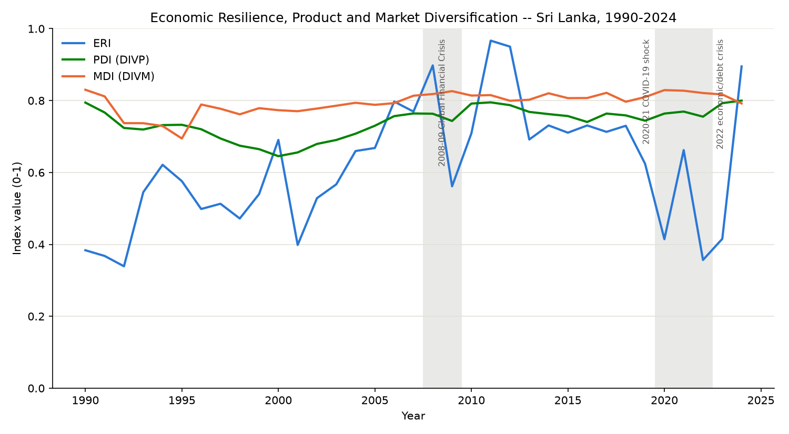
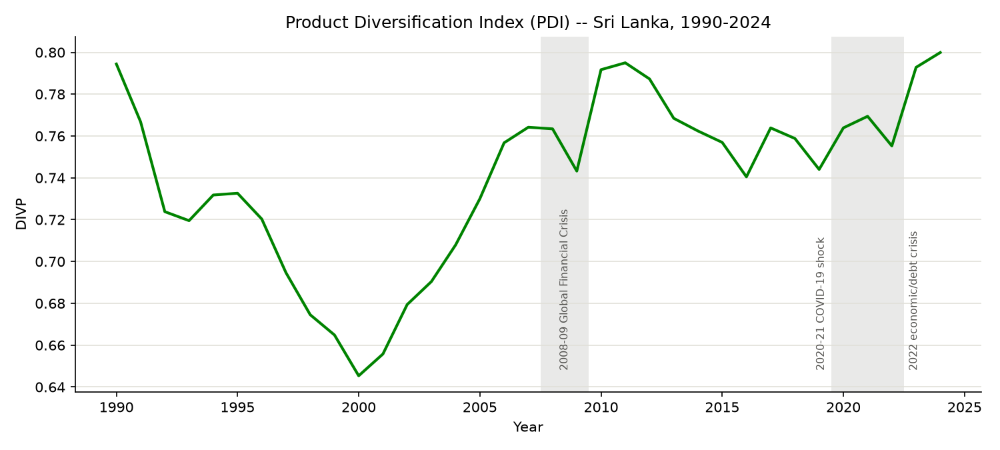
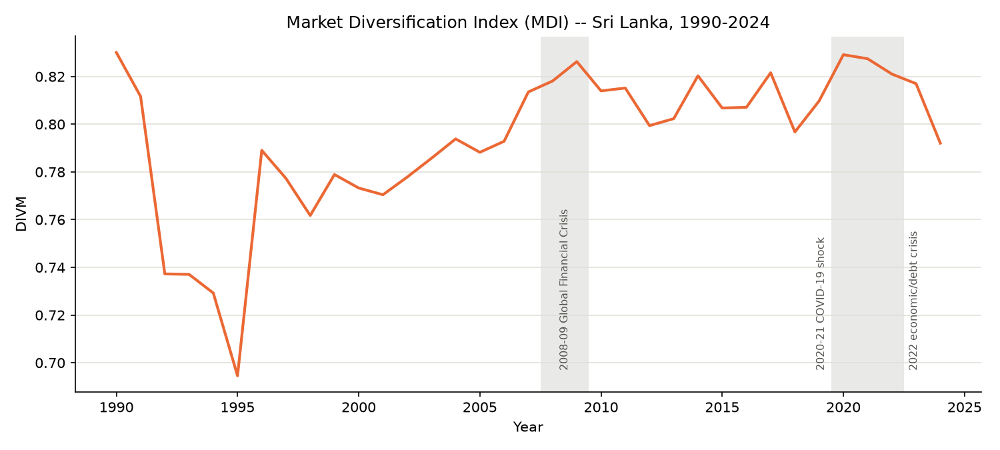
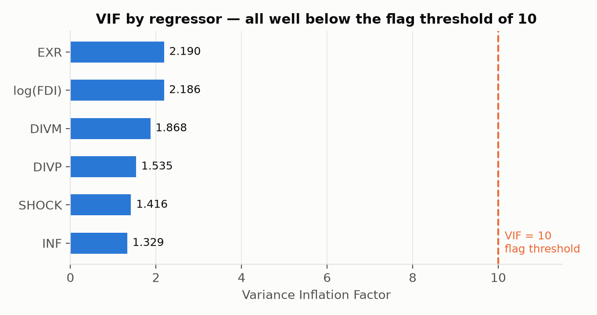
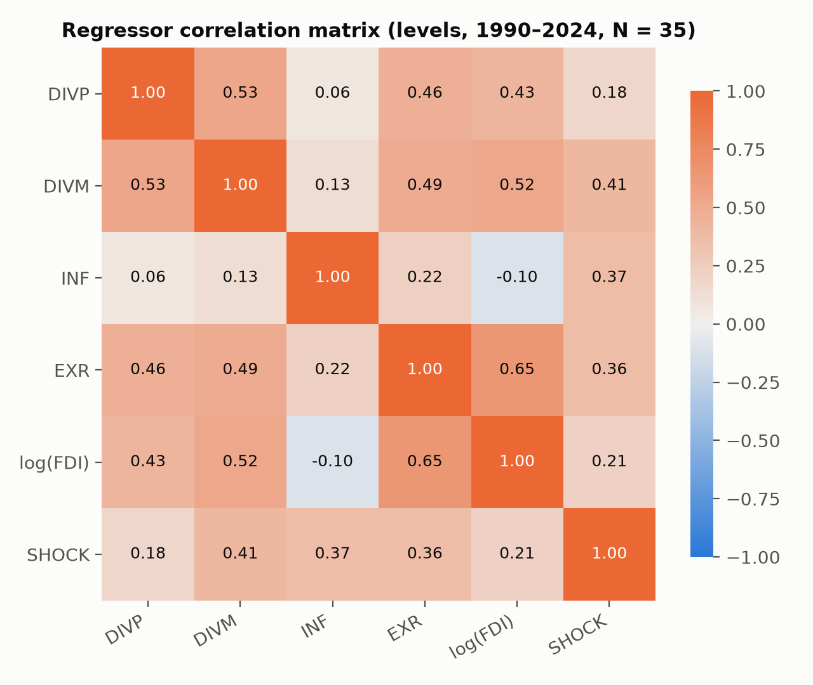
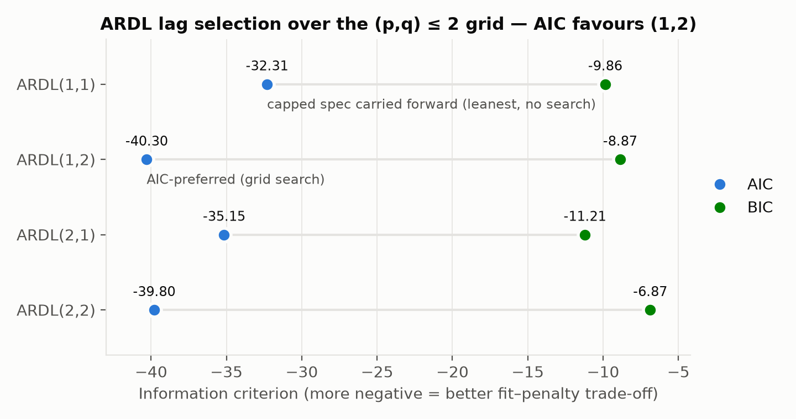
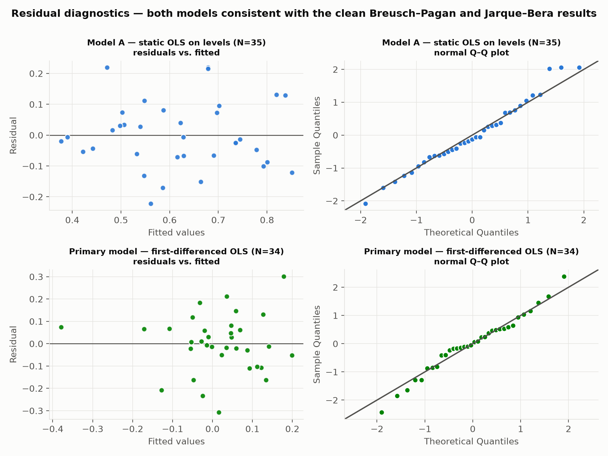
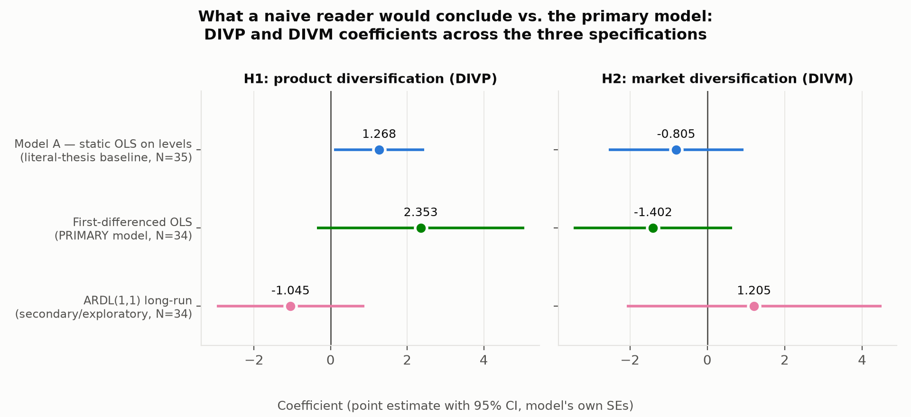
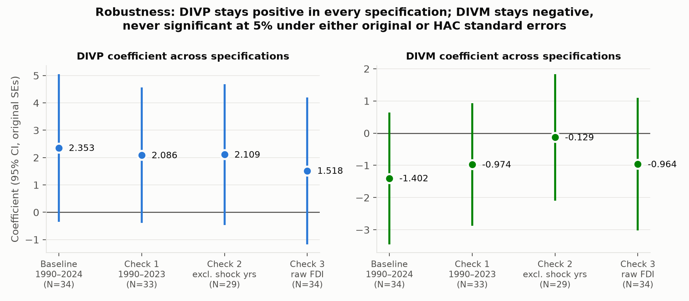

# Chapter 4: Empirical Analysis and Findings

*Evaluating the Relationship Between Export Diversification and Economic Resilience: Evidence from Sri Lanka, 1990–2024.*

> **Provenance note (not part of the thesis text).** Every number in this chapter is drawn directly from the
> computed output files under `outputs/` (produced by pipeline notebooks `i`–`viii`, `a`–`c`); nothing was
> re-estimated or recalculated during drafting. Each table cites its source file, and the "EViews cross-check"
> notes state the exact Python package and function used (per `outputs/tooling_register.csv`) so every figure can
> be reproduced manually. Coefficients and test statistics are reported to three decimal places, with
> significance denoted \*\*\* (1%), \*\* (5%), \* (10%); p-values below 0.001 are shown as "<0.001". Coefficients on
> INF, EXR, and raw FDI are shown to six decimal places where three would round them to zero. Sample sizes
> differ by design across models — N = 35 for the static OLS on levels and N = 34 for the differenced and ARDL
> specifications (one observation is consumed by differencing/lagging) — and are stated beneath every table.

## 4.0 Chapter Roadmap

This chapter presents the empirical analysis of the relationship between export diversification and economic
resilience in Sri Lanka over the period 1990–2024. It addresses the two research questions stated in Chapter 1.5:
(RQ1) how export product diversification (DIVP) and market diversification (DIVM) have trended in Sri Lanka
between 1990 and 2024, and (RQ2) what the effect of DIVP and DIVM is on economic resilience (ERI), controlling
for inflation (INF), the exchange rate (EXR), foreign direct investment (log(FDI)), and major shock episodes
(SHOCK) — in the short run and, if a long-run cointegrating relationship exists, in the long run. The hypotheses
under test, from Chapter 3.5, are:

- **H1:** the coefficient on DIVP is positive and statistically significant — higher product diversification is
  associated with higher economic resilience.
- **H2:** the coefficient on DIVM is positive and statistically significant — higher market diversification is
  associated with higher economic resilience.

The chapter proceeds in the order the analysis was run: descriptive statistics and trends (§4.1, RQ1); the
diagnostic testing sequence that determined the modeling path (§4.2); the literal-thesis static OLS baseline,
Model A (§4.3); the ARDL bounds-testing model, Model B, and the first-differenced OLS that was ultimately
designated the primary model for inference (§4.4); post-estimation diagnostics (§4.5); hypothesis testing (§4.6);
discussion (§4.7); robustness checks (§4.8); a consolidated register of deviations from the Chapter 3 methodology
(§4.9); and a chapter summary (§4.10).

## 4.1 Descriptive Statistics and Trends (RQ1)

> **Deviation flag (study period).** This analysis extends the stated 1990–2023 study period (Ch. 3.2/3.8) by one
> year, to 1990–2024 (35 annual observations), to incorporate the most recent available data. The 1990–2023
> sample matching the literal thesis text is re-estimated as Robustness Check 1 in §4.8. This deviation is also
> recorded in the consolidated register, §4.9.

### 4.1.1 Descriptive statistics

**Table 4.1 — Descriptive statistics, all variables, 1990–2024 (N = 35).**
Source: `outputs/descriptive_statistics.csv`.

| Variable | N | Mean | Std. dev. | Min | Max | Median | Skewness | Excess kurtosis |
|---|---|---|---|---|---|---|---|---|
| ERI | 35 | 0.620 | 0.171 | 0.339 | 0.967 | 0.624 | 0.190 | −0.582 |
| DIVP | 35 | 0.740 | 0.042 | 0.645 | 0.800 | 0.755 | −0.675 | −0.338 |
| DIVM | 35 | 0.793 | 0.031 | 0.695 | 0.830 | 0.799 | −1.339 | 1.828 |
| INF (%) | 35 | 10.022 | 8.619 | −0.429 | 49.721 | 7.675 | 3.085 | 12.974 |
| EXR (LKR/USD) | 35 | 121.243 | 74.166 | 40.063 | 327.507 | 108.334 | 1.548 | 2.332 |
| FDI (current USD) | 35 | 513,069,259.226 | 389,463,117.370 | 43,355,119.720 | 1,614,044,009.000 | 434,075,668.500 | 0.892 | 0.499 |
| log(FDI) | 35 | 19.699 | 0.950 | 17.585 | 21.202 | 19.889 | −0.585 | −0.399 |

Three features of Table 4.1 shape the analysis that follows. First, ERI is far more volatile (standard deviation
0.171 on a 0–1 index) than either diversification index (0.042 and 0.031), so the dependent variable moves much
more than the hypothesised drivers — any economically meaningful coefficient on DIVP or DIVM must therefore be
large in absolute terms. Second, INF is heavily right-skewed (skewness 3.085, excess kurtosis 12.974), reflecting
the 2022 inflation spike (maximum 49.721%). Third, raw FDI spans roughly $43 million to $1.6 billion against
0–1-bounded indices; the log transformation used in the regressions is a deviation from the literal thesis
specification and is flagged where it first enters a model (§4.3).

Simple correlations with the dependent variable (source: `outputs/correlation_eri_divp_divm.csv`): ERI–DIVP
0.364, ERI–DIVM 0.189, DIVP–DIVM 0.534. Both diversification indices correlate positively with resilience in the
raw data, with the product-diversification correlation roughly twice the market-diversification one; the moderate
DIVP–DIVM correlation confirms the two indices capture related but distinct dimensions of diversification.

### 4.1.2 Trends, 1990–2024

**Figure 4.1a — ERI, PDI (DIVP), and MDI (DIVM), 1990–2024, with shock periods shaded.**



**Figures 4.1b and 4.1c — the two diversification indices individually.**





In plain language, the trends answer RQ1 as follows (all facts computed from
`outputs/analysis_frame_1990_2024.csv`):

- **Market diversification has been consistently higher than product diversification.** DIVM exceeds DIVP in 32
  of the 35 years; the only exceptions are 1994, 1995, and — notably — 2024, the final year of the extended
  sample, when DIVP (0.800, its series maximum) overtakes DIVM (0.792) for the first time since 1995.
- **Product diversification traces a U-shape.** DIVP falls from 0.794 in 1990 to its minimum of 0.645 in 2000,
  then recovers steadily to its 2024 maximum of 0.800. Market diversification is comparatively flat: after an
  early dip to its 1995 minimum (0.695), DIVM stays in a narrow 0.76–0.83 band, peaking at the very start of the
  sample (0.830 in 1990) and drifting slightly downward at the end.
- **Resilience collapses in every shaded shock window and rebounds after it.** ERI falls from 0.898 (2008) to
  0.562 (2009) in the Global Financial Crisis window, to 0.414 in 2020 (COVID-19), and to its near-record low of
  0.357 in 2022 (the economic/debt crisis; the series minimum is 0.339 in 1992). The recovery from the 2022
  trough is unusually sharp: ERI reaches 0.895 by 2024, close to its 2011 maximum of 0.967.
- **Is there a structural break near 2022?** Visually, 2022 produces the deepest resilience trough of the last
  three decades followed by the steepest two-year recovery in the series, while both diversification indices barely
  move — DIVM declines gently from its 2020 peak (0.829) and DIVP continues rising through the crisis. The formal
  treatment of shock periods in the regressions is the SHOCK dummy (2008, 2009, 2020, 2021, 2022); a formal
  structural-break test is outside the scope specified in Chapter 3. (A recursive-stability CUSUM check on the
  ARDL model proved infeasible for sample-size reasons documented in §4.5.4.)

## 4.2 Diagnostic Testing Sequence

The tests below are reported in the sequence in which they were run, because their outcomes determine the
modeling path (Ch. 3 decision branch): stationarity first (§4.2.1), multicollinearity second (§4.2.2), and then
the branch decision (§4.2.3).

### 4.2.1 Stationarity: Augmented Dickey–Fuller tests

Unit-root tests were run on all six model variables at levels, and at first differences where the level test
failed to reject. **EViews cross-check:** `statsmodels.tsa.stattools.adfuller` with automatic lag selection by
AIC (uncapped unless stated); the exchange rate additionally required capped-lag ADF and Phillips–Perron variants
(rationale below).

**Table 4.2 — ADF stationarity results (source: `outputs/adf_stationarity_results.csv`).**

| Variable | Order tested | Test (specification) | Lag | N | Statistic | p-value | 5% critical value | Conclusion |
|---|---|---|---|---|---|---|---|---|
| ERI | level | ADF, constant only | 0 | 34 | −3.234 | 0.018 | −2.951 | stationary — **I(0)** |
| INF | level | ADF, constant only | 0 | 34 | −4.881 | <0.001 | −2.951 | stationary — **I(0)** |
| DIVP | level | ADF, constant only | 0 | 34 | −1.338 | 0.612 | −2.951 | non-stationary |
| DIVP | 1st diff. | ADF, constant only | 0 | 33 | −4.626 | <0.001 | −2.954 | stationary — **I(1)** |
| DIVM | level | ADF, constant only | 0 | 34 | −2.589 | 0.095 | −2.951 | non-stationary |
| DIVM | 1st diff. | ADF, constant only | 0 | 33 | −6.552 | <0.001 | −2.954 | stationary — **I(1)** |
| log(FDI) | level | ADF, constant + trend | 2 | 32 | −1.968 | 0.619 | −3.558 | non-stationary |
| log(FDI) | 1st diff. | ADF, constant only | 1 | 32 | −7.650 | <0.001 | −2.957 | stationary — **I(1)** |
| EXR | level | ADF (AIC, uncapped), constant + trend | 10 | 24 | −1.111 | 0.927 | −3.612 | non-stationary |
| EXR | level | ADF (AIC and BIC, maxlag = 4), constant + trend | 2 | 32 | 2.866 | 1.000 | −3.558 | non-stationary |
| EXR | level | Phillips–Perron, constant + trend | 10 | 34 | −1.064 | 0.935 | non-stationary | non-stationary |
| EXR | 1st diff. | ADF (AIC, uncapped), constant only | 10 | 23 | 0.218 | 0.973 | −2.998 | non-stationary (see note) |
| EXR | 1st diff. | ADF (AIC and BIC, maxlag = 4), constant only | 2 | 31 | 1.294 | 0.997 | −2.961 | non-stationary (see note) |
| EXR | 1st diff. | **Phillips–Perron, constant only** | 10 | 33 | **−5.054** | **<0.001** | −2.954 | **stationary — I(1)** |
| EXR | 2nd diff. | ADF (AIC, uncapped), constant only | 9 | 23 | 0.686 | 0.990 | −2.998 | non-stationary (see note) |

*Note on EXR (flagged for EViews cross-checking).* The exchange rate is the one variable where the ADF and
Phillips–Perron tests disagree. Uncapped-AIC ADF selects very long lags (10) in a short sample, leaving as few as
23 usable observations, and fails to reject non-stationarity even at the second difference — a pattern
symptomatic of the lag-selection artefact rather than genuine I(2) behaviour, given that EXR is a strongly
trending, structurally-shifting series (the 2022 float). The Phillips–Perron test, which corrects for serial
correlation non-parametrically rather than by adding lags, rejects the unit root cleanly at the first difference
(statistic −5.054, p < 0.001). **EXR is therefore classified as I(1) on the Phillips–Perron evidence**, and no
variable in the system is treated as I(2). Anyone re-running this in EViews should expect the plain ADF on
ΔEXR to look non-stationary if automatic (uncapped) lag selection is used, and should run the PP test to
reproduce the classification adopted here.

### 4.2.2 Multicollinearity: VIF and the regressor correlation matrix

**EViews cross-check:** VIFs computed as 1/(1−R²) from auxiliary regressions of each regressor on the others
(equivalently `statsmodels.stats.outliers_influence.variance_inflation_factor`); the correlation matrix is a
plain Pearson matrix.

**Table 4.3 — Variance Inflation Factors (source: `outputs/vif_results.csv`).**

| Regressor | VIF | Flagged (VIF > 10)? |
|---|---|---|
| EXR | 2.190 | No |
| log(FDI) | 2.186 | No |
| DIVM | 1.868 | No |
| DIVP | 1.535 | No |
| SHOCK | 1.416 | No |
| INF | 1.329 | No |



*Figure 4.2a — VIF by regressor. Every VIF is below 2.2, far under the conventional flag threshold of 10:
multicollinearity is not a concern in this regressor set.*



*Figure 4.2b — Regressor correlation matrix (source: `outputs/regressor_correlation_matrix.csv`). The largest
pairwise correlation is EXR–log(FDI) at 0.65, followed by DIVP–DIVM at 0.53 — consistent with the uniformly low
VIFs.*

### 4.2.3 Decision-branch outcome

The stationarity results place the analysis in **Branch B** of the Chapter 3 decision rule: a mix of I(0) and
I(1) variables — I(0): ERI, INF; I(1): DIVP, DIVM, EXR, log(FDI) — with **no I(2) variable** (source:
`outputs/modeling_path_decision.csv`). The implications, in the order the requirements state them:

1. Static OLS on levels (the literal Ch. 3.5 specification) risks a **spurious regression**: four of the six
   regressors are I(1), so apparently significant coefficients can be driven by shared trends rather than a real
   relationship. Model A is still estimated and reported in full (§4.3) as the literal-thesis baseline, but its
   coefficients carry that caveat.
2. **ARDL bounds testing is valid to attempt** (it requires only that no variable be I(2)) and was estimated as
   Model B (§4.4). *Deviation flag:* estimating an ARDL model at all is a deviation from the literal Ch. 3.5
   static-OLS methodology, triggered by this branch outcome rather than planned in advance; see §4.9.
3. OLS on first-differenced variables is estimated alongside both, and — for reasons documented in §4.4.5 — ended
   up as the **primary model** for H1/H2 inference.

## 4.3 Model A — Static OLS on Levels (Literal-Thesis Baseline)

Model A estimates the Chapter 3.5, Eq. 3.1 specification exactly as written:

```
ERI_t = β0 + β1·DIVP_t + β2·DIVM_t + β3·INF_t + β4·EXR_t + β5·log(FDI_t) + β6·SHOCK_t + ε_t
```

> **Deviation flag (log-FDI).** The thesis specification uses FDI in levels; this analysis substitutes
> **log(FDI)** because FDI's scale (≈ $43M–$1.6B) dwarfs the 0–1-bounded indices. This is an added
> transformation, not part of the literal Ch. 3.5 specification. The model is re-estimated with raw FDI as
> Robustness Check 3 (§4.8). Also recorded in §4.9.

**EViews cross-check:** `statsmodels.api.OLS` — equivalent to the EViews `LS` command; HAC column via
`.get_robustcov_results(cov_type='HAC', maxlags=3)` — equivalent to `LS` with the Newey–West option, maxlags = 3
from floor(4·(T/100)^(2/9)) with T = 35.

**Table 4.4 — Model A coefficients, original and HAC-robust standard errors side by side.**
Sources: `outputs/model_a_static_ols_coefficients.csv`, `outputs/model_a_hac_coefficients.csv`.

| Term | Coefficient | SE (original) | t (original) | p (original) | Sig. | SE (HAC) | t (HAC) | p (HAC) |
|---|---|---|---|---|---|---|---|---|
| Constant | −2.334 | 0.731 | −3.196 | 0.003 | \*\*\* | 0.737 | −3.167 | 0.004 |
| DIVP | 1.268 | 0.602 | 2.105 | 0.044 | \*\* | 0.574 | 2.209 | 0.036 |
| DIVM | −0.805 | 0.888 | −0.907 | 0.372 | | 0.636 | −1.266 | 0.216 |
| INF | −0.004062 | 0.002733 | −1.486 | 0.148 | | 0.002989 | −1.359 | 0.185 |
| EXR | −0.000941 | 0.000408 | −2.308 | 0.029 | \*\* | 0.000467 | −2.017 | 0.053 |
| log(FDI) | 0.143 | 0.032 | 4.488 | <0.001 | \*\*\* | 0.032 | 4.406 | <0.001 |
| SHOCK | −0.020 | 0.069 | −0.297 | 0.769 | | 0.045 | −0.457 | 0.651 |

**Table 4.5 — Model A fit statistics (source: `outputs/model_a_static_ols_fit_stats.csv`).**

| N | R² | Adj. R² | F | p(F) | AIC | BIC |
|---|---|---|---|---|---|---|
| 35 | 0.598 | 0.512 | 6.953 | <0.001 | −43.377 | −32.489 |

Taken at face value, Model A appears to support H1: DIVP enters positively and significantly at the 5% level
under both original (p = 0.044) and HAC-robust (p = 0.036) standard errors, while DIVM is negative and
insignificant (no support for H2). **However, these estimates carry the spurious-regression caveat recorded with
the model output** (`outputs/model_a_static_ols_fit_stats.csv`): DIVP, DIVM, EXR, and log(FDI) are all I(1), so
Model A's significant coefficients may reflect shared trends rather than a genuine relationship, and are **not**
treated as the primary basis for H1/H2. The contrast with the specifications that handle the integration
properties correctly is the subject of §4.4 and §4.6.

## 4.4 Model B — ARDL Bounds Testing, and the First-Differenced OLS Primary Model

### 4.4.1 Lag selection

Per Chapter 3's small-sample guidance, the maximum lag was capped at 2 to preserve degrees of freedom (with
N ≈ 33 usable observations and k = 6 regressors, each additional lag consumes 7–8 parameters). All four (p,q)
combinations on the grid were estimated on a common 33-observation sample. **EViews cross-check:** ARDL wizard
lag search, max lag 2.

**Table 4.6 — ARDL lag-selection grid (source: `outputs/ardl_lag_selection.csv`).**

| Specification | N | Parameters | AIC | BIC |
|---|---|---|---|---|
| ARDL(1,1) | 33 | 14 | −32.306 | −9.858 |
| ARDL(1,2) | 33 | 20 | **−40.295** (AIC minimum) | −8.868 |
| ARDL(2,1) | 33 | 15 | −35.152 | **−11.208** (BIC minimum) |
| ARDL(2,2) | 33 | 21 | −39.796 | −6.872 |



*Figure 4.4a — AIC and BIC across the lag grid. AIC favours ARDL(1,2); BIC favours ARDL(2,1).*

> **Judgment call, flagged rather than guessed (per the requirements).** AIC and BIC disagree — AIC selects
> (1,2), BIC selects (2,1). Two specifications were carried through the analysis: the **AIC grid-search winner
> ARDL(1,2)**, and a **capped ARDL(1,1)** chosen as the leanest specification (no search) to maximise residual
> degrees of freedom (20 vs. 14 in the final N = 34 fits, per `outputs/model_comparison_side_by_side.csv`; the
> grid in Table 4.6 shows 19 vs. 13 because the search was run on a common 33-observation sample). The capped
> ARDL(1,1) is the specification carried forward to the
> post-estimation diagnostics (§4.5) and reported as the headline Model B below; the (1,2) results are shown
> alongside it wherever they differ materially. The BIC-preferred (2,1) was not separately carried forward; this
> is an overridable default.

### 4.4.2 Bounds test for cointegration

The conditional error-correction model (Ch. 3.5, Model B) was estimated and the Pesaran, Shin & Smith (2001)
bounds F-test applied to the joint significance of the lagged levels, Case III (unrestricted intercept, no
trend), k = 6. **EViews cross-check:** `statsmodels.tsa.ardl.UECM(eri, lags=1, exog=X, order=1, trend='c')`,
then `UECMResults.bounds_test(case=3)` — equivalent to the ARDL wizard's bounds test.

**Table 4.7 — Bounds test results, both specifications (sources: `outputs/ardl_bounds_test.csv`,
`outputs/ardl_capped_1_1_bounds_test.csv`).**

| Level | Lower bound I(0) | Upper bound I(1) | F — ARDL(1,2) | F — ARDL(1,1) | Outcome (both) |
|---|---|---|---|---|---|
| 10% | 2.031 | 3.136 | 2.823 | 2.366 | between bounds — inconclusive |
| 5% | 2.328 | 3.500 | 2.823 | 2.366 | between bounds — inconclusive |
| 1% | 2.957 | 4.252 | 2.823 | 2.366 | below lower bound — no cointegration |

**The bounds test never confirms cointegration.** At the 5% level both F-statistics fall inside the inconclusive
region, and at the 1% level both fall below the lower bound. Per the Chapter 3 decision rule ("between the
bounds → inconclusive, report as such"), the long-run ARDL coefficients below are reported for completeness but
**cannot be interpreted as evidence of a long-run relationship** — this is the first of the two findings that
led to the primary-model redesignation in §4.4.5.

### 4.4.3 ARDL(1,1) long-run coefficients, error-correction term, and short-run coefficients

**Table 4.8 — ARDL(1,1) long-run coefficients, delta-method SEs (source:
`outputs/ardl_capped_1_1_long_run_coefficients.csv`; HAC columns from
`outputs/ardl_capped_1_1_long_run_hac_comparison.csv`).**

| Term | Long-run coef. | SE (delta) | t | p | Sig. | SE (HAC) | p (HAC) |
|---|---|---|---|---|---|---|---|
| Constant | 1.678 | 1.329 | 1.262 | 0.207 | | 0.847 | 0.061 |
| DIVP | −1.045 | 0.983 | −1.063 | 0.288 | | 0.676 | 0.138 |
| DIVM | 1.205 | 1.680 | 0.718 | 0.473 | | 0.692 | 0.097 |
| INF | 0.002154 | 0.007343 | 0.293 | 0.769 | | 0.006026 | 0.724 |
| EXR | 0.000055 | 0.000890 | 0.062 | 0.951 | | 0.000663 | 0.935 |
| log(FDI) | −0.130 | 0.059 | −2.191 | 0.028 | \*\* | 0.038 | 0.003 |
| SHOCK | 0.023 | 0.131 | 0.175 | 0.861 | | 0.072 | 0.753 |

N = 34. *The `cointegration_confirmed_by_bounds_test` flag stored with this table is False for every row: these
long-run values are exploratory only.* (The HAC comparison is a Python-only robustness extension and is not
directly reproducible in the EViews ARDL wizard — see `outputs/tooling_register.csv`.)

**Table 4.9 — Error-correction term (source: `outputs/ardl_capped_1_1_error_correction_term.csv`; ARDL(1,2)
comparison from `outputs/ardl_error_correction_term.csv`).**

| Specification | ECT (θ₁ on ERI(t−1)) | SE | t | p | Sig. | Negative & significant? | Within (−1, 0)? |
|---|---|---|---|---|---|---|---|
| ARDL(1,1) | −0.759 | 0.238 | −3.190 | 0.005 | \*\*\* | Yes | Yes |
| ARDL(1,2) | −1.006 | 0.271 | −3.718 | 0.002 | \*\*\* | Yes | No (≤ −1) |

The error-correction term is negative and highly significant in both specifications, and in the capped ARDL(1,1)
it lies within the theoretically expected (−1, 0) interval: taken at face value it implies that roughly **75.9%
of a deviation from the (unconfirmed) long-run resilience level is corrected within one year** — a fast
adjustment speed that speaks directly to the "restorative capacity" dimension of the resilience framework
(Ch. 2.3). This must be read with the bounds-test result in mind: a significant ECT alongside an inconclusive
bounds F-test is suggestive of, but not sufficient evidence for, a long-run relationship.

**Table 4.10 — ARDL(1,1) short-run coefficients (source: `outputs/ardl_capped_1_1_short_run_coefficients.csv`).**

| Term | Coefficient | SE | t | p | Sig. |
|---|---|---|---|---|---|
| ΔDIVP | 1.375 | 1.610 | 0.854 | 0.403 | |
| ΔDIVM | −0.949 | 1.170 | −0.811 | 0.427 | |
| ΔINF | 0.003660 | 0.006638 | 0.551 | 0.587 | |
| ΔEXR | −0.004547 | 0.002730 | −1.665 | 0.111 | |
| Δlog(FDI) | 0.116 | 0.058 | 1.980 | 0.062 | \* |
| ΔSHOCK | −0.013 | 0.086 | −0.150 | 0.882 | |

N = 34. Short-run coefficients are supplementary evidence only (Ch. 3.5, requirement on precedence): none of the
diversification terms is significant in the short run within the ARDL specification.

### 4.4.4 First-differenced OLS — the primary model

OLS on first differences of all variables (constant included) was estimated per the Branch-B requirement to
present all three specifications side by side. **EViews cross-check:** `statsmodels.api.OLS` on differenced
series — `LS` on differenced data; HAC as in Model A (maxlags = 3).

**Table 4.11 — First-differenced OLS coefficients, original and HAC-robust SEs.**
Sources: `outputs/model_b_first_differenced_ols_coefficients.csv`, `outputs/model_diff_hac_coefficients.csv`.

| Term | Coefficient | SE (original) | t (original) | p (original) | Sig. | SE (HAC) | t (HAC) | p (HAC) |
|---|---|---|---|---|---|---|---|---|
| Constant | 0.031 | 0.030 | 1.023 | 0.316 | | 0.018 | 1.670 | 0.106 |
| ΔDIVP | 2.353 | 1.379 | 1.706 | 0.100 | \* | 1.185 | 1.986 | 0.057 |
| ΔDIVM | −1.402 | 1.044 | −1.343 | 0.190 | | 0.802 | −1.750 | 0.092 |
| ΔINF | 0.000152 | 0.003758 | 0.040 | 0.968 | | 0.002605 | 0.058 | 0.954 |
| ΔEXR | −0.003543 | 0.001800 | −1.968 | 0.059 | \* | 0.000972 | −3.646 | 0.001 |
| Δlog(FDI) | 0.117 | 0.053 | 2.193 | 0.037 | \*\* | 0.045 | 2.626 | 0.014 |
| ΔSHOCK | −0.010 | 0.086 | −0.122 | 0.904 | | 0.069 | −0.152 | 0.880 |

**Table 4.12 — First-differenced OLS fit statistics (source:
`outputs/model_b_first_differenced_ols_fit_stats.csv`).**

| N | R² | Adj. R² | F | p(F) | AIC | BIC |
|---|---|---|---|---|---|---|
| 34 | 0.423 | 0.295 | 3.300 | 0.014 | −30.219 | −19.535 |

*N = 34, not 35: one observation is lost to differencing. This model's sample is not identical to Model A's.*

### 4.4.5 Deviation flag — primary-model redesignation (2026-07-17)

> **This subsection documents a material deviation from the planned methodology and is deliberately set apart.**
> The original Branch-B plan (and the thesis Update note in the research plan) designated ARDL as the primary
> model for H1/H2 inference if Branch B triggered. That designation was **reversed on 2026-07-17**, on the
> user's explicit direction, for two data-driven reasons (source: `outputs/modeling_path_decision.csv`,
> addendum):
>
> 1. **The bounds test never confirmed cointegration** — inconclusive at 5% and below the lower bound at 1% in
>    both the AIC grid-search ARDL(1,2) (F = 2.823) and the capped ARDL(1,1) (F = 2.366) specifications (§4.4.2).
>    The long-run coefficients H1/H2 would have been tested against are therefore not established as long-run
>    relationships.
> 2. **Uncorrected serial correlation in the ARDL residuals** — the Breusch–Godfrey test at lag 2 rejects
>    no-autocorrelation at 5% (LM(2) = 6.841, p = 0.033), while the first-differenced OLS passed its full
>    diagnostic battery cleanly (§4.5).
>
> **Consequence:** the **first-differenced OLS (§4.4.4) is the primary model for H1/H2 inference**; ARDL(1,1) is
> retained as a secondary/exploratory specification; Model A remains the literal-thesis baseline. All §4.6
> verdicts follow this precedence. Also recorded in the consolidated register, §4.9.

## 4.5 Post-Estimation Diagnostics

Diagnostics are reported per model, in the order run (Ch. 3.7 sequence). *Deviation flag:* the Jarque–Bera and
Ramsey RESET tests are **additions** beyond the literal Ch. 3.7 methodology, included as standard practice (both
are one-line additions in EViews); flagged here at first use and in §4.9.

### 4.5.1 Model A — static OLS on levels (source: `outputs/diagnostics_model_a_ols.csv`)

| # | Test | Statistic | df | p-value | Decision at 5% |
|---|---|---|---|---|---|
| 1 | Durbin–Watson | 1.557 | — | — | inconclusive: DW between Savin–White bounds dL = 1.16, dU = 1.803 (n = 35, k = 6) |
| 2 | Breusch–Pagan LM | 3.650 | 6 | 0.724 | no heteroskedasticity |
| 3 | Jarque–Bera *(added)* | 0.619 | 2 | 0.734 | normality not rejected (skew 0.293, kurtosis 2.717) |
| 4 | Ramsey RESET *(added)* | 0.011 | (2, 26) | 0.989 | no functional-form misspecification |

**HAC remediation note** (source: `outputs/hac_remediation_status.csv`): no test *cleanly* rejected — DW is
merely inconclusive and Breusch–Pagan is clean — so Newey–West HAC standard errors (maxlags = 3, from
floor(4·(T/100)^(2/9)), T = 35) were computed as a **precautionary robustness check and EViews cross-check**, not
because a formal rejection required them. Both SE sets are shown side by side in Tables 4.4 and 4.11.

### 4.5.2 Primary model — first-differenced OLS (source: `outputs/diagnostics_model_diff_ols.csv`)

| # | Test | Statistic | df | p-value | Decision at 5% |
|---|---|---|---|---|---|
| 1 | Durbin–Watson | 2.381 | — | — | inconclusive: DW in the upper gray zone against Savin–White bounds dL = 1.144, dU = 1.807 (n = 34, k = 6) |
| 2 | Breusch–Pagan LM | 2.150 | 6 | 0.905 | no heteroskedasticity |
| 3 | Jarque–Bera *(added)* | 0.257 | 2 | 0.879 | normality not rejected (skew −0.170, kurtosis 3.256) |
| 4 | Ramsey RESET *(added)* | 1.636 | (2, 25) | 0.215 | no functional-form misspecification |

The primary model passes every test that produces a clean decision; the only non-clean entry is the DW bounds
gray zone, which is precautionarily covered by the HAC column in Table 4.11.

### 4.5.3 Model B — capped ARDL(1,1) (source: `outputs/diagnostics_model_b_ardl_capped.csv`)

Durbin–Watson is unreliable with a lagged dependent variable, so the Breusch–Godfrey LM test is used instead
(per Ch. 3.7's ARDL provision).

| # | Test | Statistic | df | p-value | Decision at 5% |
|---|---|---|---|---|---|
| 1 | Breusch–Godfrey LM, lag 1 (model's own lag structure) | 3.319 | 1 | 0.068 | not rejected — but borderline |
| 1s | Breusch–Godfrey LM, lag 2 (sensitivity) | 6.841 | 2 | 0.033 | **rejected — residual autocorrelation at 5%** |
| 2 | Breusch–Pagan LM | 12.764 | 13 | 0.466 | no heteroskedasticity |
| 3 | Jarque–Bera *(added)* | 0.337 | 2 | 0.845 | normality not rejected |
| 4 | Ramsey RESET *(added)* | 1.682 | (2, 18) | 0.214 | no functional-form misspecification |
| 5a | Bounds F-test (restated from §4.4.2) | 2.366 | k = 6, Case III | — | inconclusive at 5% |

The Breusch–Godfrey result is **not robust to lag choice**: insignificant (barely) at lag 1 but significant at
lag 2 — the borderline lag-1 reading understates the case for residual autocorrelation in the ARDL model. This
is the second leg of the §4.4.5 redesignation.

### 4.5.4 CUSUM/CUSUMSQ infeasibility note (source: `outputs/cusum_cusumsq_model_b_status.csv`)

The Chapter 3 plan called for CUSUM/CUSUMSQ recursive-stability checks on the ARDL model "if feasible." They are
**infeasible here, and were deliberately skipped rather than silently omitted**: the SHOCK dummy equals 0 for
the first 18 of the 34 usable observations (crisis years begin in 2008), so every initial regressor window at
the standard skip = k = 14 contains an all-zero SHOCK column and is rank-deficient (singular X′X). The smallest
non-singular skip is 19, which would leave only 15 recursive residuals out of 34 observations — too few for a
meaningful stability path. This is a data-driven infeasibility given the sample size and dummy structure, not an
oversight; no CUSUM chart is fabricated for this chapter.

### 4.5.5 Residual diagnostics (visual)



*Figure 4.5 — Residuals vs. fitted values and normal Q–Q plots for Model A (top) and the primary
first-differenced OLS (bottom). Both are consistent with the clean Breusch–Pagan and Jarque–Bera results above.
Implementation note, flagged for transparency: no per-observation residual series is stored under `outputs/`, so
these plots required refitting the two already-specified models solely to extract residuals; the refits were
programmatically asserted to reproduce the stored coefficient tables exactly (to 10⁻¹⁰) before plotting.*

## 4.6 Hypothesis Testing: H1 and H2

Per the §4.4.5 precedence, the **first-differenced OLS is the evidentiary basis** for the verdicts; Model A
(naive baseline) and the ARDL long-run coefficients (secondary/exploratory) are shown for contrast.



*Figure 4.6 — The central contrast of this chapter: DIVP (left, H1) and DIVM (right, H2) point estimates with
95% confidence intervals across the three specifications. A naive reader of Model A alone would call H1
confirmed at 5% and stop; the primary model supports H1 only at the 10% level, and the exploratory ARDL long-run
coefficient even flips sign (with an interval spanning zero). Sources:
`outputs/model_comparison_side_by_side.csv` and the underlying coefficient tables.*

**Table 4.13 — Consolidated H1/H2 verdicts (source: `outputs/h1_h2_final_verdict.csv`).**

| Hyp. | Model (role) | SEs | Coefficient | p-value | Verdict |
|---|---|---|---|---|---|
| H1 (DIVP) | Model A (baseline, naive reading) | original | 1.268 | 0.044 | supported at 5% (expected sign) |
| H1 (DIVP) | Model A (baseline, naive reading) | HAC | 1.268 | 0.036 | supported at 5% (expected sign) |
| **H1 (DIVP)** | **First-differenced OLS (PRIMARY)** | **original** | **2.353** | **0.100** | **supported at 10% (expected sign)** |
| **H1 (DIVP)** | **First-differenced OLS (PRIMARY)** | **HAC** | **2.353** | **0.057** | **supported at 10% (expected sign)** |
| H1 (DIVP) | ARDL(1,1) long-run (secondary/exploratory) | delta | −1.045 | 0.288 | ambiguous — not significant at 10% |
| H1 (DIVP) | ARDL(1,1) long-run (secondary/exploratory) | HAC | −1.045 | 0.138 | ambiguous — not significant at 10% |
| H2 (DIVM) | Model A (baseline, naive reading) | original | −0.805 | 0.372 | ambiguous — not significant at 10% |
| H2 (DIVM) | Model A (baseline, naive reading) | HAC | −0.805 | 0.216 | ambiguous — not significant at 10% |
| **H2 (DIVM)** | **First-differenced OLS (PRIMARY)** | **original** | **−1.402** | **0.190** | **ambiguous — not significant at 10%** |
| **H2 (DIVM)** | **First-differenced OLS (PRIMARY)** | **HAC** | **−1.402** | **0.092** | **significant at 10% but OPPOSITE the expected sign — a genuine finding, not an error** |
| H2 (DIVM) | ARDL(1,1) long-run (secondary/exploratory) | delta | 1.205 | 0.473 | ambiguous — not significant at 10% |
| H2 (DIVM) | ARDL(1,1) long-run (secondary/exploratory) | HAC | 1.205 | 0.097 | supported at 10% (expected sign) |

**H1 — partially supported.** In the primary model, the DIVP coefficient is positive (2.353) with the expected
sign, significant at the 10% level under both original (p = 0.100) and HAC-robust (p = 0.057) standard errors,
but not at the conventional 5% level. **Economic significance:** the primary model is estimated in first
differences, so the coefficient links year-on-year changes — a 0.1-point increase in DIVP within a year is
associated with a **0.235-point higher change in ERI** in that year, holding the other regressors constant. On an
index whose full 35-year range is 0.628 points (0.339–0.967) and whose standard deviation is 0.171, that is a
large effect — roughly 1.4 standard deviations of ERI — which is precisely why the imprecision (wide confidence
interval) rather than the magnitude is what keeps H1 at the 10% rather than 5% level.

**H2 — not supported; the sign runs opposite to the hypothesis.** In the primary model the DIVM coefficient is
**negative** (−1.402): insignificant under original SEs (p = 0.190) but significant at the 10% level under HAC
SEs (p = 0.092). Per the Chapter 3 instruction, a negative and (marginally) significant coefficient is a genuine
finding to be reported, not an error: a 0.1-point increase in DIVM within a year is associated with a
0.140-point *lower* change in ERI. The only specification in which DIVM turns positive is the exploratory ARDL
long-run vector (1.205, p = 0.097 under HAC) — but that vector rests on a cointegrating relationship the bounds
test never confirmed, so it cannot outweigh the primary model. The discussion of this reversal against the
Chapter 2 literature follows in §4.7.

Among the controls in the primary model: Δlog(FDI) is positive and significant at 5% under both SE sets (0.117,
p = 0.037 original / 0.014 HAC) — the most robust covariate in the system; ΔEXR is negative and significant
(p = 0.059 original / 0.001 HAC), consistent with depreciation episodes coinciding with resilience declines; ΔINF
and ΔSHOCK are never significant, the latter presumably because the shock years' effects are already carried by
the large within-year movements of the other variables.

## 4.7 Discussion

> **[PLACEHOLDER — REQUIRES THESIS PDF.]** The full literature-facing discussion for this section requires
> Chapters 1–2 of the thesis PDF (theoretical framework, reviewed studies, and citation style), which were not
> available when this draft was prepared. Rather than invent citations or attribute positions to the Ch. 2
> literature review sight unseen, this section states what the computed results imply for the two debates the
> research plan names, and marks where thesis-specific framing must be inserted. **To complete: supply the thesis
> PDF and replace the bracketed items.**

**Product vs. market diversification.** The results, taken across every specification that respects the data's
integration properties, consistently favour the **product-diversification side of the debate**
[⟨cite the Ch. 2 studies on each side⟩]: DIVP carries a positive coefficient in the primary model (and in every
robustness variant, §4.8), while DIVM is negative in the primary model and every robustness variant — market
diversification shows no positive association with resilience in this sample, and some (10%-level, HAC) evidence
of a negative short-run association. One candidate interpretation, to be tested against the Ch. 2 framework, is
that Sri Lanka's market diversification largely predates the sample (DIVM peaked in 1990 and stayed within a
0.14-wide band thereafter, §4.1.2), so its within-year *changes* — which are what a first-differenced model
identifies — are small reshuffles among destinations rather than genuine risk-spreading gains
[⟨connect to portfolio-diversification theory, Ch. 2⟩].

**The 2022 crisis in the results.** The 2022 episode appears in the descriptives as the second-deepest
resilience trough of the series (ERI 0.357) followed by the sharpest recovery (0.895 by 2024) — a pattern that
is itself a prima facie display of restorative capacity [⟨connect to Briguglio et al. (2009), Ch. 2.3⟩]. In the
models, however, the SHOCK dummy is never significant, and the exploratory error-correction term — the parameter
that would formalise "bounce-back speed" — is fast (−0.759, ≈ 76% of a deviation corrected within a year,
significant at 1%) but sits on an unconfirmed cointegrating relationship (§4.4.2/4.4.3). The honest reading is
that the crisis's imprint is carried by the macro controls (ΔEXR, Δlog(FDI)) and the dependent variable's own
swings rather than by the dummy.

**What the Model A / primary-model contrast means.** The headline methodological lesson of the chapter (Figure
4.6) is that the literal-thesis static OLS would have overstated the evidence for H1 (5% vs. 10%) and understated
the DIVM reversal — exactly the spurious-regression risk the mixed I(0)/I(1) diagnosis predicted (§4.2.3).

## 4.8 Robustness Checks

The primary model was re-estimated under four variations (Ch. 3, step viii). **EViews cross-check:** all are
`statsmodels.api.OLS` on the correspondingly modified differenced sample; HAC columns with maxlags = 3.

**Table 4.14 — Robustness of the DIVP and DIVM coefficients (source: `outputs/robustness_checks_comparison.csv`;
fit statistics from the per-check `*_fit_stats.csv` files).**

| Check | N | DIVP coef. | p (orig.) | p (HAC) | DIVM coef. | p (orig.) | p (HAC) | R² | Note |
|---|---|---|---|---|---|---|---|---|---|
| Baseline (1990–2024, primary model) | 34 | 2.353 | 0.100\* | 0.057\* | −1.402 | 0.190 | 0.092\* | 0.423 | reference row |
| 1 — restricted to 1990–2023 | 33 | 2.086 | 0.111 | 0.069\* | −0.974 | 0.325 | 0.153 | 0.392 | drops 2024 (study-period deviation check) |
| 2 — excluding shock-year observations | 29 | 2.109 | 0.122 | 0.072\* | −0.129 | 0.898 | 0.795 | 0.451 | SHOCK regressor dropped (degenerate after filtering) |
| 3 — raw FDI instead of log(FDI) | 34 | 1.518 | 0.278 | 0.145 | −0.964 | 0.367 | 0.140 | 0.423 | counter-check on the log-FDI deviation |
| 4 — alternate ARDL lag length | — | — | — | — | — | — | — | — | N/A for the primary model (no lag structure); ARDL lag sensitivity covered in §4.4.1–4.4.2 |



*Figure 4.8 — DIVP and DIVM point estimates with 95% confidence intervals (original SEs) across the baseline and
Checks 1–3.*

How much do the coefficients move — and does the story hold?

- **DIVP stays positive in every specification** (2.353 → 2.086 → 2.109 → 1.518) and retains 10%-level HAC
  significance in the baseline and Checks 1–2. It loses significance only in Check 3 (raw FDI, p = 0.145 HAC) —
  unsurprisingly, since raw FDI's billion-dollar scale injects noise the log transform was introduced to remove
  (in that specification raw FDI itself is significant at 5%, coefficient 2.37×10⁻¹⁰, p = 0.037). Dropping the
  2024 observation (Check 1) moves DIVP by only −0.267, so the study-period extension is not driving the H1
  result.
- **DIVM stays negative in every specification** (−1.402 → −0.974 → −0.129 → −0.964) and is never significant at
  5% in any of them under either SE set. Its magnitude collapses toward zero when shock years are excluded
  (Check 2), which suggests the negative DIVM–ERI association is concentrated in crisis years.
- Incidental finding in Check 2: with shock years removed, ΔINF turns negative and significant at 5% (−0.012,
  p = 0.029 original) — inflation's drag on resilience becomes visible once the extreme 2022 co-movement is out
  of the sample.

**Overall:** the core H1 result (positive DIVP, marginal significance) and the H2 reversal (negative,
insignificant-at-5% DIVM) both survive all three implemented checks; no check flips a sign.

## 4.9 Summary of Deviations from the Literal Thesis Methodology

Every deviation was flagged inline at first occurrence; this table consolidates all five
(source: `outputs/deviations_register.csv`).

| # | Deviation | One-line justification | Flagged inline at |
|---|---|---|---|
| 1 | 1990–2024 (35 obs) study period vs. the thesis text's 1990–2023 (34 obs) | deliberate extension to the most recent available data; 1990–2023 retained as Robustness Check 1 | §4.1, §4.8 |
| 2 | log(FDI) used in place of raw FDI | FDI's ~$43M–$1.6B scale dwarfs the 0–1 indices; raw FDI retained as Robustness Check 3 | §4.3, §4.8 |
| 3 | ARDL/Model B estimated at all | not in Ch. 3.5's literal static-OLS spec — triggered by the mixed I(0)/I(1) ADF outcome, not planned in advance | §4.2.3, §4.4 |
| 4 | Jarque–Bera and Ramsey RESET tests added | not in Ch. 3.7's literal battery; standard practice and trivial to reproduce in EViews | §4.5 |
| 5 | Primary model redesignated from ARDL to first-differenced OLS (2026-07-17) | bounds test never confirmed cointegration + Breusch–Godfrey lag-2 flagged serial correlation in ARDL(1,1); differenced OLS passed all diagnostics cleanly; decided on explicit direction, not guessed | §4.4.5 |

## 4.10 Chapter Summary

This chapter tested whether export diversification is associated with economic resilience in Sri Lanka over
1990–2024. Descriptively, market diversification has remained persistently higher but flatter than product
diversification, which traced a U-shape and reached its series maximum in 2024, while resilience collapsed and
rebounded around each of the three shaded shock episodes (§4.1). Stationarity testing placed the system in the
mixed I(0)/I(1) branch, invalidating the literal static-OLS reading and triggering the ARDL path (§4.2); the
bounds test, however, never confirmed cointegration, and residual diagnostics favoured the first-differenced OLS,
which became the primary model for inference (§4.4–4.5). On that basis, H1 receives qualified support — product
diversification is positively associated with resilience at the 10% (not 5%) level, with a large point magnitude —
while H2 is not supported, with market diversification entering negatively across every specification (§4.6), a
reversal that survives all robustness checks (§4.8). The following chapter takes up these findings — the
qualified H1 support, the H2 sign reversal, and the fast but formally unconfirmed error-correction speed — for
discussion against the literature and for their policy implications.

---

*End of Chapter 4 draft. Word export (`pandoc chapter_4_empirical_analysis_and_findings.md -o …​.docx`) is
available on request but was not produced by default.*
